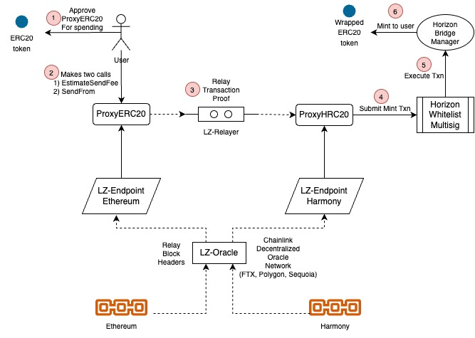

## Horizon Bridge w/ LayerZero Validation
This document briefly explains the Horizon bridge changes w/ LayerZero validation mechanism.

For every asset (ERC20 or BEP20), 
* ProxyERC20 contract that is deployed on Ethereum (similarly ProxyBEP20 contract on BSC)
  * While deploying you need to pass endpoint contract addr and ERC20 token address
  * Provides debit and credit internal functions that are called from LayerZero’s OFTCore contract
  * This proxy contract is basically acts as custodian of user funds
  * Debit function transfers from user to proxy and credit will do the reverse
* ProxyHRC20 contract that is deployed on Harmony 
  * All functionalities are similar to ProxyERC20, however on the Harmony side, we modified the credit function to mint the wrapped tokens instead of doing the liquidity transfer. The ProxyHRC20 contract is whitelisted in the Horizon such that it can directly mint.

### Bridging Process

#### Ethereum to Harmony 

    

* A user who wants to bridge their ERC20 assets, e.g., LINK to Harmony, first signs a approve transaction that allows the ProxyERC20 contract permission to transfer user tokens.
* The user or bridge then calls `estimateSendFee` to figure out how much gas is needed on the destination side.
  * e.g., `proxyERC20.estimateSendFee(dstChainId, toAddr, amount, useZeroAddr, adapterParams)`
  * `proxyERC20.estimateSendFee(116, 0xae…, 5000000000000000000, false, 0x0001000000000000000000000000000000000000000000000000000000000007a12a)`
  * adapterParams is used to customize the gas. By default 200k gas is used. The above adapter parameter is obtained for 500k gas
  * `
let adapterParams = ethers.utils.solidityPack(
['uint16','uint256'],
[1, 500000]
)
  `
  * More details [here](https://layerzero.gitbook.io/docs/guides/advanced/relayer-adapter-parameters)
  * From the output of `enstimateSendFree`, `nativeFee` field provides the required gas
* The user then signs a `sendFrom(address _from, uint16 _dstChainId, bytes calldata _toAddress, uint _amount, address payable _refundAddress, address _zroPaymentAddress, bytes calldata _adapterParams)`
  * e.g., `proxyERC20.sendFrom(0xae…, 116, 0xae…, 5000000000000000000, 0xae…, 0x0000000000000000000000000000000000000000, 0x0001000000000000000000000000000000000000000000000000000000000007a120)`
  * Make sure to put the gas calculated using the previous step (estimateSendFree.nativeFee) in the transaction value.
* After this transaction gets validated and relayed over, the ProxyHRC20 contract automatically invokes the credit command which mint the wrapped tokens to the user account.

#### Harmony to Ethereum
* All steps are similar to above, but no adapter params (custom gas) required while calling estimateSendFee and sendFrom calls.
* e.g., `proxyERC20.estimateSendFee(101, 0xae…, 5000000000000000000, false, 0x)`
* `proxyERC20.sendFrom(0xae…, 101, 0xae…, 5000000000000000000, 0xae…, 0x0000000000000000000000000000000000000000, 0x)`

### LayerZero Infrastructure
#### Ethereum
* Endpoint: 0x66A71Dcef29A0fFBDBE3c6a460a3B5BC225Cd675
* chainId: 101

#### BSC
* Endpoint: 0x3c2269811836af69497E5F486A85D7316753cf62
* chainId: 102

#### Harmony
* Endpoint: 0x9740FF91F1985D8d2B71494aE1A2f723bb3Ed9E4
* chainId: 116

### Deployment Configuration
* Deployer: 0xAC0248e9C78774bA0ef9E71B1Ce1393a10C17E3C
* Deploy solidity config: No optimization
* Contract source: https://github.com/harmony-one/solidity-examples
* Horizon bridge contract addresses used in the deployment of various proxies
  * Multisig (on Harmony): 0x0c1310bbd93c6977fde20dc813cff8236ba1f0dd
  * Multisig (on Etherem & BSC): 0x715CdDa5e9Ad30A0cEd14940F9997EE611496De6
  * ERC20 Bridge Manager (on Harmony): 0x2fbbcef71544c461edfc311f42e3583d5f9675d1
  * HRC20 Bridge Manager (on Harmony): 0x38092d17d3641b6fa49668775948af71b430765e
  * HRC20 Bridge Manager (on Ethereum): 0x4D34E61CaF7A3622759D69e48CCDeB8dee5021e8
  * BSC Bridge Manager (on Harmony): 0x0de8e70e94f4761dc5baf5833d0f13eb9fd93620
  * BSC Bridge Manager (on BSC): 0xfD53b1B4AF84D59B20bF2C20CA89a6BeeAa2c628
* Process
  * Deploy ProxyERC20 contract to Ethereum and pass LayerZero endpoint address for Ethereum and ERC20 token address
  * Deploy ProxyHRC20 contract to Harmony and pass LayerZero endpoint address for Harmony and HRC20 token address (wrapped token of ERC20)
  * Connect the two proxies by calling `setTrustedRemoteAddress` on each of the proxies. e.g., `proxyHRC20.setTrustedRemoteAddress(101, proxyERC20Addr)` and `proxyERC20.setTrustedRemoteAddress(116, proxyHRC20Addr)`
  * Do additional configurations on ProxyERC20 to allow custom gas executions. This is needed as LayerZero by default uses 200k gas, which is not sufficient to mint wrapped tokens via our multisig contract (at least 300k gas is needed). Call these two functions on the ProxyERC20 contract. `proxyERC20.setUseCustomAdapterParams(true)`, `proxyERC20.setMinDstGas(dstChainId, packetType, minGas)`, `dstChainId: 116`, `packetType: 0`, `minGas: 300000`
  * The newly created ProxyHRC20 contract needs to be whitelisted in the Multisig contract.

### Deployed Proxies
* LINK
  * ProxyERC20: 0xEe381e476b4335B8584A2026f3E845edaC2c69de
  * ProxyHRC20: 0x6bEe6e5cf8E02833550B228D9CC6aD19Dae3743E
* ONE (Wrapped ONE on Ethereum)
  * Token: 0xd5cd84d6f044abe314ee7e414d37cae8773ef9d3
  * ProxyERC20: 0x768Fa1aBbC38054f9fB2218e97778CC7b110C779
  * ProxyHRC20: 0x905582f21fB9855c809d5b8933272a292dfbB138
* ONE (Wrapped ONE on BSC)
  * Token: 0x03fF0ff224f904be3118461335064bB48Df47938
  * ProxyBEP20: 0x55b9b75F2D456D010e6b8c6F62544c6EfC1c101D
  * ProxyHRC20: 0x5B18a4E73F9A4fe337A072516b317863Ad3046aA
* BNB (Wrapped BnB on Harmony)
  * Token: 0xDC60CcF6Ae05f898F4255EF580E731b4011100Ec
  * ProxyBEP20: 0x128AEdC7f41ffb82131215e1722D8366faaD0CD4
  * ProxyHRC20: 0x2c99FB3Da8c9308991C428f56D9F269F007Bd843
* ETH
  * Token: 0x4cC435d7b9557d54d6EF02d69Bbf72634905Bf11
  * ProxyERC20: 0x1Edb8BdeD80E1b87eD19EE7D97Ee80B4fDb615c1
  * ProxyHRC20: 0x8d1eBcDa83fd905b597bF6d3294766B64ecF2AA7
* WBTC
  * Token (Eth): 0x2260FAC5E5542a773Aa44fBCfeDf7C193bc2C599
  * Token (Hmy): 0x118f50d23810c5E09Ebffb42d7D3328dbF75C2c2
  * ProxyERC20: 0x7A49bede3363304D69A0e09548B8B4c5EfD84ba4
  * ProxyHRC20: 0x55E63987e788B1C1C13d70f0592e678f38943e73
* USDC
  * Token (Eth): 0xA0b86991c6218b36c1d19D4a2e9Eb0cE3606eB48
  * Token (Hmy): 0xBC594CABd205bD993e7FfA6F3e9ceA75c1110da5
  * ProxyERC20: 0x4f52b41a778761bd2eea5b7b7ed8cbdaa02cef3e
  * ProxyHRC20: 0xfB5a2461D49D83348C557A5Ad7AA938DCF444d7f
* USDT
  * Token (Eth): 0xdAC17F958D2ee523a2206206994597C13D831ec7
  * Token (Hmy): 0xF2732e8048f1a411C63e2df51d08f4f52E598005
  * ProxyERC20: 0xF6a097b278383eF0A800ABD7d700b29B159B19b5
  * ProxyHRC20: 0x9e61d6A7B4746922E68D710d9454D3558BC8dF1C
* DAI
  * Token (Eth): 0x6B175474E89094C44Da98b954EedeAC495271d0F
  * Token (Hmy): 0xd068722E4e1387E4958300D1e625d2878f784125
  * ProxyERC20: 0x85db5268403700e901285E8B8Fb0CADf4212B95E
  * ProxyHRC20: 0x664491FD329a1b98d83Cf585CC2e54af5Ab11CBD
* BUSD
  * Token (Eth): 0x4Fabb145d64652a948d72533023f6E7A623C7C53
  * Token (Hmy): 0xFeee03BFBAA49dc8d11DDAab8592546018dfb709
  * ProxyERC20: 0xAd7514b8B1EADFad8B1Ff0873Dba52E304C87446
  * ProxyHRC20: 0xaDC74a8D0A066519252eF2C61776552e7bD2ab8c
* BUSD (BSC)
  * Token (Bsc): 0xe9e7CEA3DedcA5984780Bafc599bD69ADd087D56
  * Token (Hmy): 0x1Aa1F7815103c0700b98f24138581b88d4cf9769
  * ProxyBEP20: 0x98e871aB1cC7e3073B6Cc1B661bE7cA678A33f7F
  * ProxyHRC20: 0x10681e186C5A9565230BADd8c9422bf26C2D8B21
* AAG
  * Token (Eth): 0x5ba19d656B65f1684cFea4Af428C23B9f3628F97
  * Token (Hmy): 0xAE0609A062a4eAED49dE28C5f6A193261E0150eA
  * ProxyERC20: 0x128AEdC7f41ffb82131215e1722D8366faaD0CD4
  * ProxyHRC20: 0x3a220588A9c76Cc928a10cDa5D59162A4B328c51
* FRAX
  * Token (Eth): 0x853d955aCEf822Db058eb8505911ED77F175b99e
  * Token (Hmy): 0xd9E290C1Cb1cAF57ca12A4F03fC3eE5689bF2D83
  * ProxyERC20: 0x0486d2c4E7Be28c8B45459DcB23De077c03b299d
  * ProxyHRC20: 0x869860b1086103077780657788871EB5d510985a
* FXS
  * Token (Eth): 0x3432B6A60D23Ca0dFCa7761B7ab56459D9C964D0
  * Token (Hmy): 0xbea6830380Dfb0283A699B0E085309215A24d9cc
  * ProxyERC20: 0x3e843802863904CB57C8f0f810e430A49C841d02
  * ProxyHRC20: 0xF689CD65C3d981DC68545eC1E8e666C243cEA028
* SUSHI
  * Token (Eth): 0x6B3595068778DD592e39A122f4f5a5cF09C90fE2
  * Token (Hmy): 0x41b7199da8276DbdEd449D717BAFFaB8C43A6a10
  * ProxyERC20: 0x7b0c1DDBef7ce61911208f84cfc0BcD1184236d0
  * ProxyHRC20: 0x7E46C325ca5119F379D9911EDF11f57dF94144F4
* xSUSHI
  * Token (Eth): 0x8798249c2E607446EfB7Ad49eC89dD1865Ff4272
  * Token (Hmy): 0x4caC2771ab80107a5035bFEc0aB7E745ed598D8D
  * ProxyERC20: 0x85bA92E2adE9EF7857850C7c0E6f7AC441fA6E57
  * ProxyHRC20: 0x2d69DD6489345F87326CF97E14A8bD65a51b8d59
* AAVE
  * Token (Eth): 0x7Fc66500c84A76Ad7e9c93437bFc5Ac33E2DDaE9
  * Token (Hmy): 0x8fD86715C0939138ff8D268B3fbF23043856a52e
  * ProxyERC20: 0xAB29422593a2044DAA02150C9Bb145d587cf4FDB
  * ProxyHRC20: 0x5085d983C015e06d73111DAb1B1ff7B3912e5bC6

